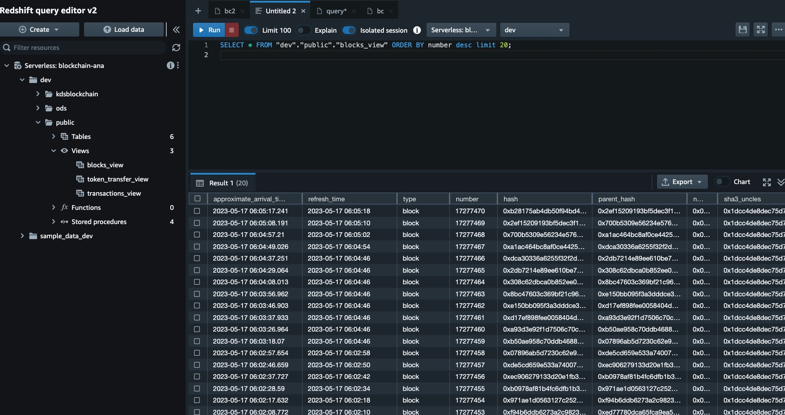

# **Web3** **Serverless** Analytics Solution on AWS
We will use Ethereum as an example to walk you through the steps required to build a serverless blockchain analysis pipeline on AWS.

* [中文文档 点这里](./README_CN.md)


## **Solution Overview**


1. Deploy an Ethereum full node on the Amazon EC2 Graviton instance to synchronize Ethereum blockchain mainnet data.
2. Use Ethereum ETL to extract block, transaction and other data to Amazon Kinesis Data Stream.
3. Use AWS Lambda to process the data and write it to another Kinesis Data Stream.
4. Ingest data from Kinesis Data Streams into Amazon Redshift Serverless in real time for analysis through the feature streaming ingestion.
5. Visualize data with Amazon QuickSight.


## **AWS Services Including**

* EC2 Graviton
* Kinesis Data Stream
* RedShift Serverless
* QuickSight
* Lambda

## 1. Deploy Ethereum Full Node on Graviton Instance

Ethereum from Proof of Work (PoW) to Proof of Stake (PoS) on September 2022. In order to deploy full nodes we need both execution client and consensus client.

* **Instance Type** : m6g.2xlarge
* **OS**: Ubuntu 20 TSL
* **Geth** : v1.11.6 stable-ea9e62ca-linux-arm64
* **Lighthouse** : lighthouse-v4.1.0-aarch64-linux-gnu
1.1 **execution client**: **Geth**

Installing Geth on Ubuntu

```bash
sudo add-apt-repository ppa:ethereum/ethereum
sudo apt-get update -y
sudo apt-get upgrade -y
sudo apt-get install ethereum -y
```
Start Geth process

```bash
/usr/bin/geth --authrpc.addr localhost --authrpc.port 8551 --authrpc.vhosts localhost --authrpc.jwtsecret /tmp/jwtsecret --syncmode snap --http --http.api personal,eth,net,web3,txpool --http.corsdomain *
```
1.2 **consensus client:lighthouse**

```bash
cd ~ curl -LO https://github.com/sigp/lighthouse/releases/download/v4.0.1/lighthouse-v4.0.1-x86_64-unknown-linux-gnu.tar.gz 
tar -xvf lighthouse-v4.0.1-x86_64-unknown-linux-gnu.tar.gz`
```
Start Lighthouse  process

```bash
lighthouse bn --network mainnet --execution-endpoint http://localhost:8551 --execution-jwt /tmp/jwtsecret --checkpoint-sync-url=https://mainnet.checkpoint.sigp.io  --disable-deposit-contract-sync
```
1.3 **interacting with the Geth**

```bash
 geth attach <datadir>/geth.ipc
```
1.4 **check  eth.syncing status**

```bash
eth.syncing
```
1.5 **eth.syncing**

When the synchronization is complete, the terminal can query the last blocknumber

```bash
> eth.blockNumber
```
## **2. Extract block data to kinesis**

2.1 Create Kinesis Data Streaming

* Create Kinesis
  * blockchain-kinesis-t
  * blockchain-kinesis
    2.2 Process data using lambda(python 3.8)

```python
import json
import time
import base64
import boto3
import datetime;
kinesis_client = boto3.client('kinesis')

def lambda_handler(event, context):
    result_records=[]
    start_time = time.time() 
    for record in event['Records']:
        #Kinesis data is base64 encoded so decode here
        payload=base64.b64decode(record["kinesis"]["data"])
        b_value = json.loads(payload)     
        pk = str(datetime.datetime.now().timestamp())
        print ("pk is " + str(pk))
        result_event = json.dumps(b_value).encode('utf8')
        #print(result_event)      
        package_data = {'Data' :result_event,'PartitionKey':pk}
        result_records.append(package_data)
      
      
    response = kinesis_client.put_records(
        StreamName='blockchain-kinesis',
        Records=result_records
    )
```
**Installing Ethereum ETL**

`sudo apt install python3-pip`

Extract data from nodes to Kinesis using EthereumETL

* 2.2 Ethereum ETL
  * Extract data to kiniesis

  ```
  ethereumetl stream  -e block,transaction,token_transfer  --start-block 17277219 \
  --provider-uri file:///home/ubuntu/.ethereum/geth.ipc \
  --output=kinesis://blockchain-kinesis-t
  ```
* 2.2 Query the data entered into kinesis
  

## 3. ingestion data to RedShift

3.1   Create a materialized view for streaming ingestion
Create an external schema to map the data from Kinesis Data Streams to an Amazon Redshift :

```
CREATE EXTERNAL SCHEMA kdsblockchain
FROM KINESIS
IAM_ROLE 'arn:aws:iam::0123456789:role/blockchain-ana-redshift-role'
```
Create the materialized view for data ingestion

```
CREATE MATERIALIZED VIEW blocks_view AUTO REFRESH YES AS
SELECT approximate_arrival_timestamp,
refresh_time,
JSON_EXTRACT_PATH_TEXT(FROM_VARBYTE(kinesis_data, 'utf-8'),'type')::TEXT as type,
JSON_EXTRACT_PATH_TEXT(FROM_VARBYTE(kinesis_data, 'utf-8'),'number')::BIGINT as number,
JSON_EXTRACT_PATH_TEXT(FROM_VARBYTE(kinesis_data, 'utf-8'),'hash')::TEXT as hash,
JSON_EXTRACT_PATH_TEXT(FROM_VARBYTE(kinesis_data, 'utf-8'),'parent_hash')::TEXT as parent_hash,
JSON_EXTRACT_PATH_TEXT(FROM_VARBYTE(kinesis_data, 'utf-8'),'nonce')::TEXT as nonce,
JSON_EXTRACT_PATH_TEXT(FROM_VARBYTE(kinesis_data, 'utf-8'),'sha3_uncles')::TEXT as sha3_uncles,
JSON_EXTRACT_PATH_TEXT(FROM_VARBYTE(kinesis_data, 'utf-8'),'logs_bloom')::TEXT as logs_bloom,
JSON_EXTRACT_PATH_TEXT(FROM_VARBYTE(kinesis_data, 'utf-8'),'transactions_root')::TEXT as transactions_root,
JSON_EXTRACT_PATH_TEXT(FROM_VARBYTE(kinesis_data, 'utf-8'),'state_root')::TEXT as state_root,
JSON_EXTRACT_PATH_TEXT(FROM_VARBYTE(kinesis_data, 'utf-8'),'receipts_root')::TEXT as receipts_root,
JSON_EXTRACT_PATH_TEXT(FROM_VARBYTE(kinesis_data, 'utf-8'),'miner')::TEXT as miner,
JSON_EXTRACT_PATH_TEXT(FROM_VARBYTE(kinesis_data, 'utf-8'),'difficulty')::NUMERIC(38) as difficulty,
JSON_EXTRACT_PATH_TEXT(FROM_VARBYTE(kinesis_data, 'utf-8'),'total_difficulty')::NUMERIC(38) as total_difficulty,
JSON_EXTRACT_PATH_TEXT(FROM_VARBYTE(kinesis_data, 'utf-8'),'size')::BIGINT as size,
JSON_EXTRACT_PATH_TEXT(FROM_VARBYTE(kinesis_data, 'utf-8'),'extra_data')::TEXT as extra_data,
JSON_EXTRACT_PATH_TEXT(FROM_VARBYTE(kinesis_data, 'utf-8'),'gas_limit')::BIGINT as gas_limit,
JSON_EXTRACT_PATH_TEXT(FROM_VARBYTE(kinesis_data, 'utf-8'),'gas_used')::BIGINT as gas_used,
JSON_EXTRACT_PATH_TEXT(FROM_VARBYTE(kinesis_data, 'utf-8'),'timestamp')::INT as timestamp,
JSON_EXTRACT_PATH_TEXT(FROM_VARBYTE(kinesis_data, 'utf-8'),'transaction_count')::BIGINT as transaction_count,
JSON_EXTRACT_PATH_TEXT(FROM_VARBYTE(kinesis_data, 'utf-8'),'item_id')::TEXT as item_id,
JSON_EXTRACT_PATH_TEXT(FROM_VARBYTE(kinesis_data, 'utf-8'),'item_timestamp')::TEXT as item_timestamp
FROM kdsblockchain."blockchain-kinesis" where JSON_EXTRACT_PATH_TEXT(FROM_VARBYTE(kinesis_data, 'utf-8'),'type') in ('block');
```
Data is ingested to RedShfit using Redshfit Stream Ingestion

3.3 Query Data through Redshfit Query editor


## 4. Query data using QuickSight


1. Current block height.
2. Popular erc20 addresses in time window.
3. Blocks per minute and gas consumption.
4. top 10 transfer out address.
5. top 10 transfer in address .
